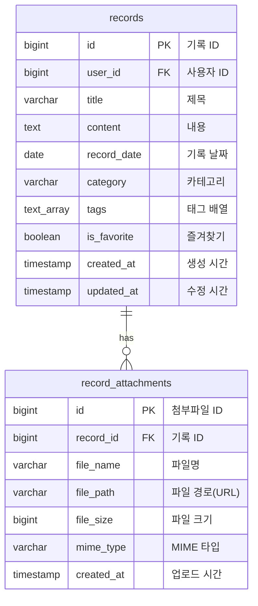

# 히스토리 페이지 ERD (조회 전용)

## 📖 개요
히스토리 페이지는 **조회 전용** 페이지입니다.
- 메인 페이지에서 작성된 기록을 **읽기만** 합니다.
- 책(그리모어) 형태로 표시합니다.
- 검색, 필터링, 정렬 기능을 제공합니다.

---

## 📊 히스토리 페이지에서 사용하는 테이블



---

## 🔍 히스토리 페이지 주요 기능

### 1. 기록 목록 조회
```sql
-- 사용자의 모든 기록을 날짜순으로 조회
SELECT 
    id,
    title,
    content,
    record_date,
    category,
    tags,
    is_favorite,
    created_at
FROM records
WHERE user_id = $1
ORDER BY record_date DESC NULLS LAST;
```

### 2. 카테고리 필터링
```sql
-- 특정 카테고리의 기록만 조회
SELECT * FROM records
WHERE user_id = $1 AND category = $2
ORDER BY record_date DESC;
```

### 3. 태그 필터링
```sql
-- 특정 태그가 포함된 기록 조회
SELECT * FROM records
WHERE user_id = $1
  AND $2 = ANY(tags)
ORDER BY record_date DESC;
```

### 4. 검색
```sql
-- 제목이나 내용으로 검색
SELECT * FROM records
WHERE user_id = $1
  AND (
    title ILIKE '%' || $2 || '%'
    OR content ILIKE '%' || $2 || '%'
  )
ORDER BY record_date DESC;
```

### 5. 즐겨찾기 필터
```sql
-- 즐겨찾기한 기록만 조회
SELECT * FROM records
WHERE user_id = $1 AND is_favorite = TRUE
ORDER BY record_date DESC;
```

### 6. 첨부파일 포함 조회
```sql
-- 기록과 첨부파일을 함께 조회
SELECT 
    r.*,
    json_agg(
        json_build_object(
            'id', a.id,
            'fileName', a.file_name,
            'fileSize', a.file_size,
            'mimeType', a.mime_type,
            'url', a.file_path
        )
    ) FILTER (WHERE a.id IS NOT NULL) AS attachments
FROM records r
LEFT JOIN record_attachments a ON r.id = a.record_id
WHERE r.user_id = $1
GROUP BY r.id
ORDER BY r.record_date DESC;
```

---

## 📋 히스토리 페이지 데이터 흐름

```
사용자 로그인
    ↓
히스토리 페이지 접속
    ↓
GET /records (API 호출)
    ↓
records 테이블 조회
    ↓
record_attachments 테이블 JOIN
    ↓
데이터 반환
    ↓
그리모어(책) 형태로 표시
    ↓
사용자가 필터링/검색
    ↓
GET /records?category=학습 (API 호출)
    ↓
필터링된 데이터 반환
    ↓
그리모어 업데이트
```

---

## 🎯 히스토리 페이지 UI 구성

### 1. 검색 바
- 키워드 입력
- 실시간 검색

### 2. 필터 버튼
- 카테고리 필터
- 태그 필터
- 즐겨찾기 필터

### 3. 그리모어 (책)
- 왼쪽 페이지: 기록 내용
- 오른쪽 페이지: 기록 내용
- 페이지 넘기기 애니메이션
- 목차 기능

### 4. 기록 상세
- 제목
- 내용
- 날짜
- 카테고리
- 태그
- 첨부파일 (이미지, 문서 등)

---

## 📊 히스토리 페이지에서 사용하는 API

### 1. 기록 목록 조회
```
GET /records
Query Parameters:
  - page: 페이지 번호
  - limit: 페이지당 개수
  - category: 카테고리 필터
  - tag: 태그 필터
  - favorite: 즐겨찾기 필터
  - search: 검색어
  - sort: 정렬 (date_desc, date_asc)
```

### 2. 특정 기록 조회
```
GET /records/:id
```

### 3. 첨부파일 조회
```
GET /records/:id/attachments
```

### 4. 통계 조회
```
GET /statistics/summary
GET /statistics/monthly
GET /statistics/categories
```

### 5. 태그 목록 조회
```
GET /tags
GET /tags/popular
```

---

## 🔒 히스토리 페이지 권한

### 읽기 전용 (Read-Only)
- ✅ 기록 조회
- ✅ 검색
- ✅ 필터링
- ✅ 정렬
- ✅ 첨부파일 다운로드
- ✅ 통계 조회

### 불가능한 작업
- ❌ 기록 생성 (메인 페이지에서만 가능)
- ❌ 기록 수정 (메인 페이지에서만 가능)
- ❌ 기록 삭제 (메인 페이지에서만 가능)
- ❌ 첨부파일 업로드 (메인 페이지에서만 가능)

---

## 📐 시각적 구조 (ASCII)

```
┌─────────────────────────────────────────────────────────────────┐
│                  히스토리 페이지 (조회 전용)                      │
└─────────────────────────────────────────────────────────────────┘
                              │
                              │ GET /records
                              ↓
        ┌─────────────────────────────────────────────────────┐
        │              records (기록 테이블)                   │
        │                  (읽기 전용)                         │
        ├─────────────────────────────────────────────────────┤
        │ PK  id                BIGSERIAL                      │
        │ FK  user_id           BIGINT         NOT NULL        │
        │     title             VARCHAR(255)   NOT NULL        │
        │     content           TEXT           NOT NULL        │
        │     record_date       DATE           NULL            │
        │     category          VARCHAR(100)   NULL            │
        │     tags              TEXT[]         NULL            │
        │     created_at        TIMESTAMP      DEFAULT NOW()   │
        │     updated_at        TIMESTAMP      DEFAULT NOW()   │
        ├─────────────────────────────────────────────────────┤
        │ 인덱스:                                              │
        │  • idx_records_user_id (user_id)                    │
        │  • idx_records_record_date (record_date DESC)       │
        │  • idx_records_category (category)                  │
        │  • idx_records_tags (tags) USING GIN                │
        │  • idx_records_user_date (user_id, record_date)     │
        └────────────────────┬────────────────────────────────┘
                             │
                             │ 1:N (LEFT JOIN)
                             │ ON records.id = record_attachments.record_id
                             ↓
        ┌─────────────────────────────────────────────────────┐
        │         record_attachments (첨부파일 테이블)         │
        │                  (읽기 전용)                         │
        ├─────────────────────────────────────────────────────┤
        │ PK  id                BIGSERIAL                      │
        │ FK  record_id         BIGINT         NOT NULL        │
        │     file_name         VARCHAR(255)   NOT NULL        │
        │     file_path         VARCHAR(500)   NOT NULL        │
        │     file_size         BIGINT         NULL            │
        │     mime_type         VARCHAR(100)   NULL            │
        │     created_at        TIMESTAMP      DEFAULT NOW()   │
        ├─────────────────────────────────────────────────────┤
        │ 인덱스:                                              │
        │  • idx_attachments_record_id (record_id)            │
        ├─────────────────────────────────────────────────────┤
        │ 외래키:                                              │
        │  • record_id REFERENCES records(id)                 │
        │    ON DELETE CASCADE                                │
        └─────────────────────────────────────────────────────┘
```

---

## 📊 상세 테이블 구조

### records 테이블

```
┌──────────────┬──────────────┬──────────────┬─────────────────┐
│   컬럼명      │    타입       │   제약조건    │      설명        │
├──────────────┼──────────────┼──────────────┼─────────────────┤
│ id           │ BIGSERIAL    │ PK           │ 기록 고유 ID     │
│ user_id      │ BIGINT       │ FK, NOT NULL │ 사용자 ID        │
│ title        │ VARCHAR(255) │ NOT NULL     │ 기록 제목        │
│ content      │ TEXT         │ NOT NULL     │ 기록 내용        │
│ record_date  │ DATE         │ NULL         │ 기록 날짜        │
│ category     │ VARCHAR(100) │ NULL         │ 카테고리         │
│ tags         │ TEXT[]       │ NULL         │ 태그 배열        │
│ created_at   │ TIMESTAMP    │ DEFAULT NOW()│ 생성 시간        │
│ updated_at   │ TIMESTAMP    │ DEFAULT NOW()│ 수정 시간        │
└──────────────┴──────────────┴──────────────┴─────────────────┘

외래키: user_id → users(id) ON DELETE CASCADE
```

### record_attachments 테이블

```
┌──────────────┬──────────────┬──────────────┬─────────────────┐
│   컬럼명      │    타입       │   제약조건    │      설명        │
├──────────────┼──────────────┼──────────────┼─────────────────┤
│ id           │ BIGSERIAL    │ PK           │ 첨부파일 고유 ID │
│ record_id    │ BIGINT       │ FK, NOT NULL │ 기록 ID          │
│ file_name    │ VARCHAR(255) │ NOT NULL     │ 파일명           │
│ file_path    │ VARCHAR(500) │ NOT NULL     │ 파일 경로(URL)   │
│ file_size    │ BIGINT       │ NULL         │ 파일 크기(bytes) │
│ mime_type    │ VARCHAR(100) │ NULL         │ MIME 타입        │
│ created_at   │ TIMESTAMP    │ DEFAULT NOW()│ 업로드 시간      │
└──────────────┴──────────────┴──────────────┴─────────────────┘

외래키: record_id → records(id) ON DELETE CASCADE
```

---

## 💡 히스토리 페이지 특징

### 1. 조회 최적화
- 인덱스를 활용한 빠른 검색
- 페이지네이션으로 성능 향상
- 캐싱 전략 적용 가능

### 2. 사용자 경험
- 책 형태의 직관적인 UI
- 부드러운 페이지 넘김 애니메이션
- 빠른 검색 및 필터링

### 3. 데이터 보안
- 읽기 전용 권한
- 사용자 본인의 데이터만 조회
- JWT 토큰 기반 인증

---

## 🎨 그리모어 UI 구성

### 페이지 구조
```
┌─────────────────────────────────────────┐
│  [검색창] [카테고리] [태그] [즐겨찾기]    │
├─────────────────────────────────────────┤
│                                         │
│     ┌──────────┬──────────┐            │
│     │          │          │            │
│     │  왼쪽    │  오른쪽  │  ← 그리모어 │
│     │  페이지  │  페이지  │            │
│     │          │          │            │
│     └──────────┴──────────┘            │
│                                         │
│     [◀ 이전]  [목차]  [다음 ▶]         │
│                                         │
└─────────────────────────────────────────┘
```

### 기록 표시 형식
```
┌─────────────────────┐
│  제목: 프로젝트 시작  │
│  날짜: 2025-12-01    │
│  카테고리: 학습       │
│  태그: #개발 #시작    │
│  ⭐ (즐겨찾기)       │
├─────────────────────┤
│                     │
│  오늘부터 새로운     │
│  프로젝트를 시작...  │
│                     │
├─────────────────────┤
│  📎 첨부파일:        │
│  • image.jpg        │
│  • document.pdf     │
└─────────────────────┘
```

---

## 📊 샘플 데이터 (히스토리 페이지 관점)

### 조회되는 기록 예시
```json
{
  "id": 1,
  "title": "프로젝트 시작",
  "content": "오늘부터 새로운 프로젝트를 시작했다...",
  "recordDate": "2025-12-01",
  "category": "학습",
  "tags": ["프로젝트", "개발", "시작"],
  "isFavorite": false,
  "attachments": [
    {
      "id": 1,
      "fileName": "screenshot.png",
      "fileSize": 1024000,
      "mimeType": "image/png",
      "url": "https://cdn.example.com/files/screenshot.png"
    }
  ],
  "createdAt": "2025-12-01T10:00:00Z"
}
```

---

## 🔄 메인 페이지 vs 히스토리 페이지

| 기능 | 메인 페이지 (기록실) | 히스토리 페이지 |
|------|---------------------|----------------|
| 기록 작성 | ✅ 가능 | ❌ 불가능 |
| 기록 수정 | ✅ 가능 | ❌ 불가능 |
| 기록 삭제 | ✅ 가능 | ❌ 불가능 |
| 파일 업로드 | ✅ 가능 | ❌ 불가능 |
| 기록 조회 | ✅ 가능 | ✅ 가능 |
| 검색 | ✅ 가능 | ✅ 가능 |
| 필터링 | ✅ 가능 | ✅ 가능 |
| 통계 조회 | ✅ 가능 | ✅ 가능 |
| UI 형태 | 폼/리스트 | 책(그리모어) |

---

## 🚀 성능 최적화

### 1. 쿼리 최적화
```sql
-- 인덱스 활용
CREATE INDEX idx_records_user_date ON records(user_id, record_date DESC);

-- 페이지네이션
SELECT * FROM records
WHERE user_id = $1
ORDER BY record_date DESC
LIMIT 20 OFFSET 0;
```

### 2. 캐싱 전략
- 자주 조회되는 데이터는 Redis 캐싱
- 태그 목록, 카테고리 목록 캐싱
- 통계 데이터 캐싱 (1시간)

### 3. 이미지 최적화
- CDN 사용
- 썸네일 생성
- Lazy Loading

---

## 📝 요약

히스토리 페이지는:
1. **조회 전용** 페이지입니다.
2. `records`와 `record_attachments` 테이블만 사용합니다.
3. 메인 페이지에서 작성된 데이터를 **읽기만** 합니다.
4. 책(그리모어) 형태로 아름답게 표시합니다.
5. 검색, 필터링, 정렬 기능을 제공합니다.

**데이터 흐름**: 메인 페이지(작성) → DB → 히스토리 페이지(조회) → 그리모어(표시)
