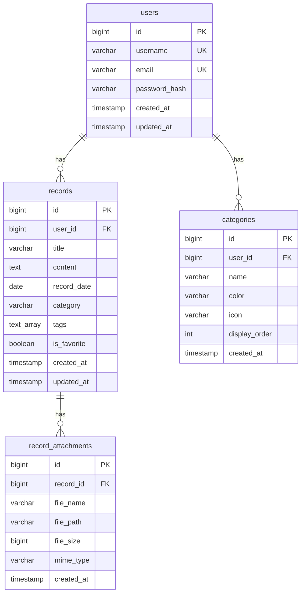

# 히스토리 시스템 ERD (Entity Relationship Diagram)

## 📊 테이블 관계도



---

## 📋 테이블 상세 설명

### 1. users (사용자)
사용자 계정 정보를 저장하는 테이블

| 컬럼명 | 타입 | 제약조건 | 설명 |
|--------|------|----------|------|
| id | BIGSERIAL | PK | 사용자 고유 ID |
| username | VARCHAR(100) | UNIQUE, NOT NULL | 사용자명 |
| email | VARCHAR(255) | UNIQUE, NOT NULL | 이메일 주소 |
| password_hash | VARCHAR(255) | NOT NULL | 암호화된 비밀번호 |
| created_at | TIMESTAMP | DEFAULT NOW() | 생성 시간 |
| updated_at | TIMESTAMP | DEFAULT NOW() | 수정 시간 |

**인덱스**:
- `idx_users_email` ON (email)
- `idx_users_username` ON (username)

---

### 2. records (기록)
사용자가 작성한 기록을 저장하는 메인 테이블

| 컬럼명 | 타입 | 제약조건 | 설명 |
|--------|------|----------|------|
| id | BIGSERIAL | PK | 기록 고유 ID |
| user_id | BIGINT | FK, NOT NULL | 사용자 ID |
| title | VARCHAR(255) | NOT NULL | 기록 제목 |
| content | TEXT | NOT NULL | 기록 내용 |
| record_date | DATE | NULL | 기록 날짜 (사용자 지정) |
| category | VARCHAR(100) | NULL | 카테고리 |
| tags | TEXT[] | NULL | 태그 배열 |
| is_favorite | BOOLEAN | DEFAULT FALSE | 즐겨찾기 여부 |
| created_at | TIMESTAMP | DEFAULT NOW() | 생성 시간 |
| updated_at | TIMESTAMP | DEFAULT NOW() | 수정 시간 |

**인덱스**:
- `idx_records_user_id` ON (user_id)
- `idx_records_record_date` ON (record_date DESC)
- `idx_records_category` ON (category)
- `idx_records_tags` ON (tags) USING GIN
- `idx_records_user_date` ON (user_id, record_date DESC)
- `idx_records_favorite` ON (user_id, is_favorite) WHERE is_favorite = TRUE

**외래키**:
- `user_id` REFERENCES users(id) ON DELETE CASCADE

---

### 3. categories (카테고리)
사용자가 정의한 카테고리 정보

| 컬럼명 | 타입 | 제약조건 | 설명 |
|--------|------|----------|------|
| id | BIGSERIAL | PK | 카테고리 고유 ID |
| user_id | BIGINT | FK, NOT NULL | 사용자 ID |
| name | VARCHAR(100) | NOT NULL | 카테고리 이름 |
| color | VARCHAR(7) | NULL | 색상 코드 (예: #FF5733) |
| icon | VARCHAR(50) | NULL | 아이콘 (이모지 등) |
| display_order | INT | DEFAULT 0 | 표시 순서 |
| created_at | TIMESTAMP | DEFAULT NOW() | 생성 시간 |

**인덱스**:
- `idx_categories_user_id` ON (user_id)

**외래키**:
- `user_id` REFERENCES users(id) ON DELETE CASCADE

**유니크 제약**:
- UNIQUE(user_id, name) - 사용자별 카테고리명 중복 불가

---

### 4. record_attachments (첨부파일)
기록에 첨부된 파일 정보

| 컬럼명 | 타입 | 제약조건 | 설명 |
|--------|------|----------|------|
| id | BIGSERIAL | PK | 첨부파일 고유 ID |
| record_id | BIGINT | FK, NOT NULL | 기록 ID |
| file_name | VARCHAR(255) | NOT NULL | 파일명 |
| file_path | VARCHAR(500) | NOT NULL | 파일 경로 (URL) |
| file_size | BIGINT | NULL | 파일 크기 (bytes) |
| mime_type | VARCHAR(100) | NULL | MIME 타입 |
| created_at | TIMESTAMP | DEFAULT NOW() | 업로드 시간 |

**인덱스**:
- `idx_attachments_record_id` ON (record_id)

**외래키**:
- `record_id` REFERENCES records(id) ON DELETE CASCADE

---

## 🔗 관계 설명

### 1. users ↔ records (1:N)
- 한 사용자는 여러 개의 기록을 작성할 수 있습니다.
- 사용자가 삭제되면 해당 사용자의 모든 기록도 삭제됩니다. (CASCADE)

### 2. users ↔ categories (1:N)
- 한 사용자는 여러 개의 카테고리를 생성할 수 있습니다.
- 사용자가 삭제되면 해당 사용자의 모든 카테고리도 삭제됩니다. (CASCADE)

### 3. records ↔ record_attachments (1:N)
- 한 기록은 여러 개의 첨부파일을 가질 수 있습니다.
- 기록이 삭제되면 해당 기록의 모든 첨부파일도 삭제됩니다. (CASCADE)

---

## 📐 시각적 ERD (ASCII)

```
┌─────────────────┐
│     users       │
├─────────────────┤
│ PK  id          │
│ UK  username    │
│ UK  email       │
│     password    │
│     created_at  │
│     updated_at  │
└────────┬────────┘
         │
         │ 1:N
         │
    ┌────┴────────────────────────┐
    │                             │
    │                             │
┌───▼──────────────┐    ┌────────▼────────┐
│    records       │    │   categories    │
├──────────────────┤    ├─────────────────┤
│ PK  id           │    │ PK  id          │
│ FK  user_id      │    │ FK  user_id     │
│     title        │    │     name        │
│     content      │    │     color       │
│     record_date  │    │     icon        │
│     category     │    │     display_ord │
│     tags[]       │    │     created_at  │
│     is_favorite  │    └─────────────────┘
│     created_at   │
│     updated_at   │
└────────┬─────────┘
         │
         │ 1:N
         │
┌────────▼──────────────┐
│ record_attachments    │
├───────────────────────┤
│ PK  id                │
│ FK  record_id         │
│     file_name         │
│     file_path         │
│     file_size         │
│     mime_type         │
│     created_at        │
└───────────────────────┘
```

---

## 🎯 데이터 흐름

### 기록 작성 플로우
```
1. 사용자 로그인
   ↓
2. 메인 페이지에서 기록 작성
   ↓
3. records 테이블에 INSERT
   ↓
4. 첨부파일이 있으면 record_attachments 테이블에 INSERT
   ↓
5. 히스토리 페이지에서 조회
   ↓
6. records + record_attachments JOIN 하여 표시
```

### 카테고리 관리 플로우
```
1. 사용자가 카테고리 생성
   ↓
2. categories 테이블에 INSERT
   ↓
3. 기록 작성 시 category 필드에 카테고리명 저장
   ↓
4. 카테고리별 필터링 가능
```

---

## 📊 샘플 데이터 예시

### users 테이블
| id | username | email | created_at |
|----|----------|-------|------------|
| 1 | testuser | test@example.com | 2025-12-01 |
| 2 | admin | admin@example.com | 2025-12-01 |

### records 테이블
| id | user_id | title | record_date | category | tags | is_favorite |
|----|---------|-------|-------------|----------|------|-------------|
| 1 | 1 | 프로젝트 시작 | 2025-12-01 | 학습 | ["프로젝트","개발"] | false |
| 2 | 1 | 첫 기능 완성 | 2025-12-15 | 학습 | ["개발","완성"] | true |
| 3 | 1 | 오늘의 생각 | 2025-12-25 | 일기 | ["생각"] | false |

### categories 테이블
| id | user_id | name | color | icon | display_order |
|----|---------|------|-------|------|---------------|
| 1 | 1 | 일기 | #FF6B6B | 📔 | 1 |
| 2 | 1 | 메모 | #4ECDC4 | 📝 | 2 |
| 3 | 1 | 학습 | #45B7D1 | 📚 | 3 |

### record_attachments 테이블
| id | record_id | file_name | file_size | mime_type |
|----|-----------|-----------|-----------|-----------|
| 1 | 1 | screenshot.png | 1024000 | image/png |
| 2 | 2 | document.pdf | 512000 | application/pdf |

---

## 🔍 주요 쿼리 패턴

### 1. 사용자의 모든 기록 조회 (첨부파일 포함)
```sql
SELECT 
    r.*,
    json_agg(
        json_build_object(
            'id', a.id,
            'fileName', a.file_name,
            'fileSize', a.file_size,
            'url', a.file_path
        )
    ) FILTER (WHERE a.id IS NOT NULL) AS attachments
FROM records r
LEFT JOIN record_attachments a ON r.id = a.record_id
WHERE r.user_id = 1
GROUP BY r.id
ORDER BY r.record_date DESC;
```

### 2. 카테고리별 기록 개수
```sql
SELECT 
    c.name,
    c.color,
    c.icon,
    COUNT(r.id) AS record_count
FROM categories c
LEFT JOIN records r ON c.name = r.category AND c.user_id = r.user_id
WHERE c.user_id = 1
GROUP BY c.id, c.name, c.color, c.icon
ORDER BY c.display_order;
```

### 3. 태그별 기록 개수
```sql
SELECT 
    unnest(tags) AS tag,
    COUNT(*) AS count
FROM records
WHERE user_id = 1
GROUP BY unnest(tags)
ORDER BY count DESC;
```

---

## 💡 설계 고려사항

### 1. 정규화
- 3NF(제3정규형) 준수
- 중복 데이터 최소화
- 데이터 무결성 보장

### 2. 인덱스 전략
- 자주 조회되는 컬럼에 인덱스 생성
- 복합 인덱스로 쿼리 성능 최적화
- GIN 인덱스로 배열 검색 성능 향상

### 3. CASCADE 정책
- 사용자 삭제 시 관련 데이터 자동 삭제
- 기록 삭제 시 첨부파일 자동 삭제
- 데이터 일관성 유지

### 4. 확장성
- 태그는 배열로 저장하여 유연성 확보
- 카테고리는 별도 테이블로 관리
- 첨부파일은 별도 테이블로 확장 가능

---

## 🚀 향후 확장 가능성

### 1. 공유 기능
```sql
CREATE TABLE record_shares (
    id BIGSERIAL PRIMARY KEY,
    record_id BIGINT REFERENCES records(id),
    shared_with_user_id BIGINT REFERENCES users(id),
    permission VARCHAR(20),  -- 'read', 'write'
    created_at TIMESTAMP DEFAULT NOW()
);
```

### 2. 댓글 기능
```sql
CREATE TABLE record_comments (
    id BIGSERIAL PRIMARY KEY,
    record_id BIGINT REFERENCES records(id),
    user_id BIGINT REFERENCES users(id),
    content TEXT NOT NULL,
    created_at TIMESTAMP DEFAULT NOW()
);
```

### 3. 버전 관리
```sql
CREATE TABLE record_versions (
    id BIGSERIAL PRIMARY KEY,
    record_id BIGINT REFERENCES records(id),
    title VARCHAR(255),
    content TEXT,
    version_number INT,
    created_at TIMESTAMP DEFAULT NOW()
);
```